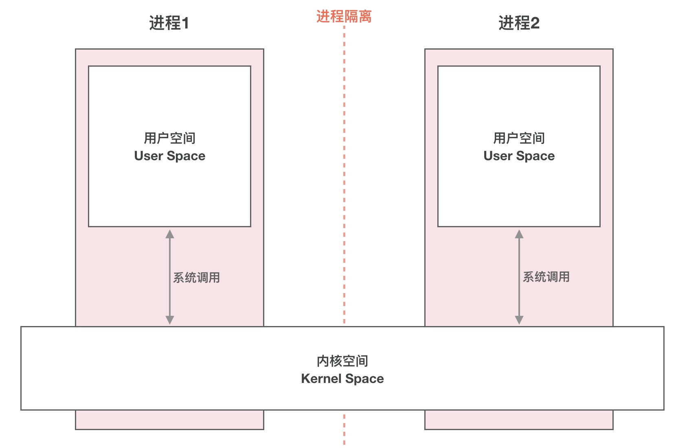

# Binder原理剖析
## 一、概述
    Binder是一种进程间通信机制,基于开源的OpenBinder实现;从字面上来解释Binder有胶水、粘合剂的意思,顾名思义就是粘和不同的进程,使其实现通信.对于Binder更全面的定义,之后再介绍

## 为什么必须理解Binder?
作为Android开发你会有这样的疑问:
* 为什么Activity间传递对象需要序列化?
* Activity的启动流程是怎么样的?
* 四大组件底层的通信机制是咋样的?
* Aidl内部的实现原理是什么?
* 插件化编程技术应该从和学起? 
  
这些都和binder有莫大的关系

## 为什么是Binder?
Android系统是基于Linux内核的,Linux已经提供了管道、消息队列、共享内存和Socket等IPC机制.为什么Android还要提供Binder来实现IPC呢?主要是基于性能、稳定性和安全性几方面的原因.
### 性能
首先说说性能上的优势.Socket作为一款通用接口,传输效率低,开销大,主要用在夸网络的进程间通信和本机上进程间的低速通信.消息队列和管道采用存储-转发方式,既数据先从发送方缓存区拷贝到内核开辟的缓存中,然后再从内核缓存区拷贝到接收方缓存区,至少有两次拷贝过程.共享内存虽然无需拷贝,但控制复杂,难以使用.Binder只需要一次数据拷贝,性能上仅次与共享内存.

注:各种IPC方式数据拷贝次数,
| 通信方式             | 数据拷贝次数 |
| -------------------- | ------------ |
| 共享内存             | 0            |
| Binder               | 1            |
| Socket/管道/消息队列 | 2            |

### 稳定性
Binder基于C/S架构,客户端有什么需求就丢给服务端去完成,架构清晰、职责明确又互相独立,自然稳定性更好.共享内存虽然无需拷贝,但是控制负责,难以使用.从稳定性的角度讲,Binder机制是优于内存共享的.

### 安全性
另一方面就是安全性.Android作为一个开放性的平台,市场上有各类海量的应用供用户选择安装,因此安全性对于Android平台及其重要.作为用户当然不希望我们下载的app偷偷读取我们的信息,上传我的隐私数据,后台偷跑流量,消耗手机电量.传统的IPC没有任何安全措施,完全依赖上层协议来确保.首先传统的IPC接收方法无法获取对方可靠的进程用户ID/进程ID(UID/PID),从而无法鉴别对方身份.Android为每个安装好的APP分配了自己的UID,故而进程的UID是鉴别进程身份的重要标志.传统的IPC只能由用户在数据包中填入UID/PID,但这样不可靠,容易被恶意程序利用.可靠的身份标识只有由IPC机制在内核中添加.其次传统的IPC访问接入点是开放的,只要知道这些接入点的程序都可以和对端建立链接,不管怎样都无法阻止恶意程序通过猜测接收方地址获取连接.同时Binder既支持实名Binder,又支持匿名Binder,安全性高.

比如Android在Manifest.xml文件的manifest节点添加sharedUserId属性,设置两个app之间通信(私有通信)

基于上述原因,Android需要家里一套新的IPC机制来满足系统对稳定性、传输线和安全性方面的要求,这就是Binder

最后用表格总结Binder的优势:
|  优势  |                        描述                    |
| ---- | ------------------------------------------------ |
|  性能  |      只需要一次数据拷贝,性能上仅次于共享内存       |
| 稳定性 |     基于C/S架构,职责明确,架构清晰,因此稳定性好     |
| 安全性 | 为每个APP分配UID,进程的UID是鉴别进程身份的重要标志 |

## 二、Linux下传统的进程间通信原理
了解Linux IPC相关的概念和原理有助于我们理解BInder通信原理.因此,在介绍Binder跨进程通信之前,我们先聊聊Linux系统下传统的进程间通信是如何实现的.

### 基本概念

上图展示了Linux中跨进程通信涉及到的一些基本概念:
*   进程隔离
*   进程空间划分:用户空间(User Space)/内核空间(Kernel Space)
*   系统调用:用户态/内核态
  
### 进程隔离
简单的说就是操作系统中,进程间的内存是不共享的.两个进程就像两个平行的世界,A进程没法直接访问B进程的数据,这就是进程隔离的通俗解释.A进程和B进程之间要进行数据交互就得采用特殊的通信机制:进程间通信(IPC).

### 进程空间划分:用户空间(User Space)/内核空间(Kernel Space)
现在操作系统都采用的虚拟存储器,对于32位系统而言,它的寻址空间(虚拟存储空间)就是2的32次方,也就是4GB.操作系统的核心是内核,独立于普通的应用程序,可以访问受保护的内存空间,也可以访问底层硬件设备的权限.为了保护用户进程不能直接操作内核,保证内核的安全,操作系统从逻辑上将虚拟空间划分为用户空间(User Space)和内核空间(Kernel Space).针对Linux操作系统而言,将最高的1GB字节供内核使用,称为内核空间;较低的3GB字节供各进程使用,称为用户空间.

``` 简单的说就是,内核空间(Kernel)是系统内核运行的空间,用户空间(User Space)是用户查询运行的空间.为了保证安全性,他们之间是隔离的 ```


### 系统调用:用户态与内核态
虽然从逻辑上进程了用户空间和内核空间的划分,但不可避免的用户空间需要访问内核资源,比如文件操作、访问网络等.为了突破隔离限制,就需要借助系统调用来实现.系统调用是用户空间访问内核空间的唯一方式,保证了所有的资源访问都是在内核的控制下进行的,避免了用户查询对系统资源的越权访问,提升了系统安全性和稳定性.

Linux使用两级保护机制:0 级供系统内核使用, 3 级供用户程序使用.
当一个任务(进程)执行系统调用而陷入内核代码中执行.当进程处于内核态时,执行的内核代码使用当前进程的内核栈.每个进程都有自己的内核栈.

当进程在执行用户自己的代码的时候,我们称其处于用户运行态(用户态).此时处理器在特权级最低的(3级)用户代码中运行.

系统调用主要通过如下两个函数来实现:
copy_from_user()  //将数据从用户空间拷贝到内核空间
copy_to_user() // 将数据从内核空间拷贝到用户空间

## Linux下的传统IPC通信原理

理解了上面的概念,我们来看看传统IPC方式中,进程之间如何实现通信的.

通常的做法是消息发送方要将发送的数据放在内存缓存区中,通过系统调用进入内核态/然后内核程序在内核空间分配内存,开辟一块内核缓存区,调用copyfromuser()函数将数据从用户空间的内存缓存区拷贝到内核空间的内核缓存区中.同样的,接收方进程在接收数据时在自己的用户空间开辟一块内存缓存区,然后内核程序调用copytouser()函数将数据从内核缓存区拷贝到接收进程的内存缓存区.这样数据发送方进程和数据接收方进程就完成了一次数据传输,我们称完成了一次进程间通信.如下图:


这种传统的IPC通信方式有两个问题:
1.  性能地下,一次数据传递需要经历:内存缓存区-->内核缓存区-->内存缓存区,需要2次数据的拷贝;
2.  接收数据的缓存区由数据接收进程提供,但是接收进程并不知道需要多大的空间来存放将要传递过来的数据,因此只能开辟尽可能大的内存空间或者先调用API接收消息头来获取消息体的大小,这两种做法不是浪费空间就是浪费时间.

## 三、Binder跨进程通信原理
理解了Linux IPC相关概念和通信原理,接下来我们正式介绍Binder IPC原理

### 动态可加载内核模块 && 内存映射
正如前面所说,跨进程通信是需要内核空间做支持的.传统IPC机制如管道、Socket都是内核的一部分,因此通过内核支持来实现进程间通信自然是没问题的.但是Binder并不是Linux系统内核的一部分,那怎么办?这就得益于Linux的动态可加载内核模块(Loadable Kernel Module,LKM)的机制;模块是具有独立功能的程序,它可以被单独编译,但是不能独立运行.它在运行时被链接到内核作为内核的一部分运行.这样,Android系统就可以通过动态添加一个内核模块运行在内核空间,用户进程之间通过这个内核模块作为桥梁来实现通信

```在Android系统中,这个运行在内核空间,负责各个用户进程通过Binder实现通信的内核模块就叫Binder驱动(Binder Driver) ```

那么在Android系统中用户进程之间是如何通过这个内核模块(Binder 驱动)来实现通信的呢?难道是和前面说的传统IPC机制一样,先将数据从发送方进程拷贝到内核缓存区,然后再将数据从内核缓存区拷贝到接收方进程,通过两次拷贝来实现的吗?显然不是,否则也不会有开篇所说的Binder再性能方面的优势了.

这就不得不通道Linux下的另一个概念:内存映射.

Binder IPC机制中涉及到的内存映射通过mmap()来实现,mmap()是造作系统中一种内存映射的方法.内存映射简单的讲就是将用户空间的一块内存区域映射到内核空间.映射关系建立后,用户对这块内存区域的修改可以直接反应到内核空间;反之内核空间对这段区域的修改也能直接反应到用户空间.

内存映射能减少数据拷贝次数,实现用户空间和内核空间的高效互动.两个空间各自的修改能直接反映在映射的内存区域,从而被对方空间及时感知.也正因为如此,内存映射能够提供对进程间通信的支持.

### Binder IPC 实现原理
Binder IPC正式基于内存映射(mmap)来实现的,但是mmap()通常是在用在物理介质的文件系统上的.

比如进程中的用户区域是不能直接和物理设备打交道的,如果想要把磁盘上的数据读取到进程的用户区域,需要两次拷贝(磁盘-->内核空间-->用户空间);通常在这种场景下mmap()就能发挥作用,通过在物理介质和用户空间之间建立映射,减少数据的拷贝次数,用内存读写取代I/O读写,提高文件读取效率.

而Binder并不存在物理介质,因此Binder驱动使用mmap()并不是为了再物理介质和用户空间之间建立映射,而是用来在内核空间创建数据接收的缓存空间.

一次完整的Binder IPC通信过程是这样的:
1. 首先Binder驱动在内核空间创建一个数据接收缓存区;
2. 接着在内核空间开辟一块内核缓存区,建立内核缓存区和内核中数据接收缓存区之间的映射关系,以及内核中数据接收缓存区和接收进程用户空间地址的映射关系;
3. 发送方进程通过系统调用copfromuser()将数据copy到内核中的内核缓存,由于内核缓存区和接收进程的用户空间存在内存映射,因此就相当于把数据发送到了接收进程的用户空间,这样便完成了一次进程间的通信.

如下图:


## 四、Binder通信模型
介绍完Binder IPC的底层通信原理,接下来我们看实现层如何设计.

一次完成的进程间通信必然至少包含两个进程,通常我们称通信的双方分别是客户端进程(client)和服务端进程(Server),由于进程隔离机制的存在,通信双方必然需要借助Binder来实现.

### Client/Server/ServiceManager/binder驱动

前面我们介绍过,Binder是基于C/S架构的.由一系列的组件组成,包括Client,Server,ServiceManager,Binder驱动.其中Service Manager和Binder驱动由系统提供,而Client,server由应用程序来实现.Client,Server和ServiceManager均是通过系统调用open,mmap和ioctl来访问设备文件/dev/binder,从而实现与Binder驱动的交互来间接的时间跨进程通信.


client,Server,ServiceManager,Binde驱动这几个组件在通信过程中扮演的角色就如同互联网中服务器(Server),客户端(client),DNS域名服务器(ServiceManager)以及路由器(Binder驱动)之间的关系.

通常我们访问一个网页的步骤是这样的:首先在浏览器输入一个地址,如google.com然后按下回车键.但是并没有办法通过域名直接找到我们要访问的服务器,因此需要首先访问DNS域名服务器,域名服务器中保存了google.com对应的ip地址10.10.10l,然后通过这个ip地址才能放到google.com对应的服务器


<!-- #### Binder驱动
binder驱动就如同路由器一样,是整个通信的核心;驱动负责进程之间Binder通信的建立,Binder在进程之间的传递,Binder引用计数管理,数据包在进程之间的传递和交互等一系列底层支持.

#### ServiceManager与实名Binder
ServiceManafer和DNS类似,作用是将字符形式的Binder名字转化为Client中对该Binder的引用.使得Client能够通过Binder的名字获取对Binder实例的引用.注册了名字的Binder叫实名Binder,就像网站一样除了有IP地址外,还有自己的网址.Server创建了Binder,并为它起一个字符形式,可读易记的名字,将这个Binder实例连同名字一起以数据包的形式通过Binder驱动发送给ServiceManager,通知ServiceManager注册一个名为"张三"的Binder,他位于某个Server中.驱动这个 -->


### Binder通信过程
1. 首先,一个进程使用BINDERSETCONTEXT_MGR命令通过Binder驱动将自己注册成为ServiceManager;
2. Server 通过驱动向ServiceManager中注册Binder(Server中的Binder实体),表明可以对外提供服务.驱动为这个Binder创建位于内核中的实体节点以及ServiceManager对实体的引用,将名字以及新建的引用打包给ServiceManager,ServiceManager将其填入查找表.
3. Client通过名字,在Binder驱动的帮助下从ServiceManager中获取到对Binder实体的引用,通过这个引用就能实现和Server进程的通信.
   
我们看到整个通信过程都需要Binder驱动的接入.下图能更加直观的展现整个通信过程(为了进一步抽象通信过程以及呈现上的方便,下图我们忽略了Binder实体及其引用的概念):


### Binder通信中的代理模式
我们已经清楚Client,Server借助Binder驱动完成夸进程通信的实现机制,但是还有个问题会让我困惑.A进程想要B进程中某个对象是如何实现的呢?毕竟他们分属不通的进程,A进程没法直接使用B进程中的Object.

前面我们介绍过跨进程通信的过程都有Binder驱动的参与,因此在数据流经Binder驱动的时,驱动会对数据左一层转换.当A进程想要获取B进程中的Object时,驱动并不会真的把object返回给A,而是返回了一个和Object看起来一模一样的代理对象objectproxy,这个objectProxy具有和object一模一样的方法,但是这些方法并没有B进程中object对象那些方法的能力,这些方法只需要把请求参数交给驱动即可.对于A进程来说和直接调用object中的方法是一样的.

当Binder驱动接收到A进程的消息后,发现这是个obejctproxy就去查询自己维护的表单,一查发现这个B进程object的代理对象.于是就会去通知B进程调用object的方法,并要求B进程把返回结果发给自己.当驱动拿到B进程的返回结果后就会转发给A进程,一次通信就完成了.


### Binder的完整定义

* 从进程间通信的角度看,Binder是一种进程间通信的进制
* 从Server进程的角度看,Binder指的是Server中的Binder实体对象
* 从Client进程的角度看,Binder指的是对Binder代理对象,是BInder实体对象的一个远程代理
* 从传输过程的角度看,Binder是一个可以跨进程传输的对象;Binder驱动会对这个夸进程边界的对象做一点点特殊处理,自动完成代理对象和本地对象之间的转换.
  
